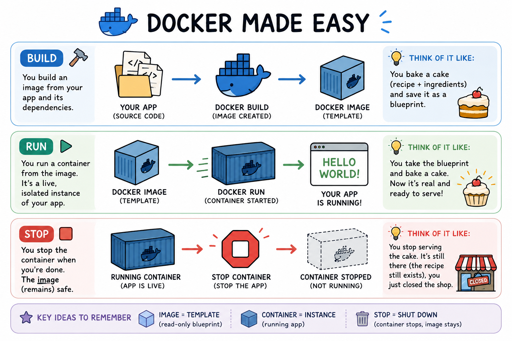
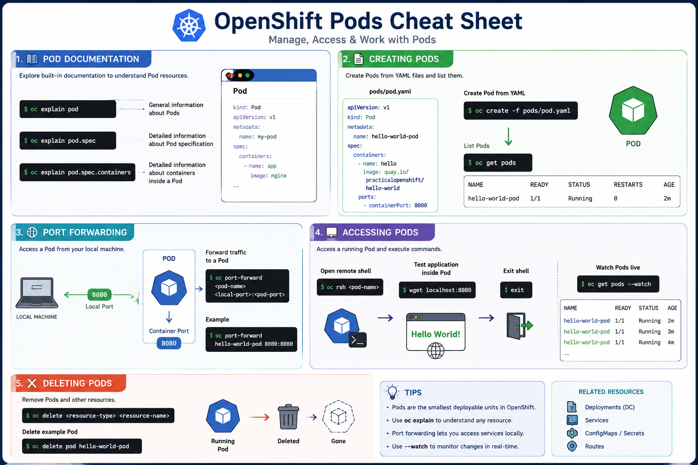

# 🚀 OpenShift & Docker Cheat Sheet

<p align="center">
  Practical OpenShift & Docker commands for learning containers, deployments, builds, networking, scaling, and templates.
</p>

---

# 📚 Table of Contents

* [🐳 Docker Basics](#-docker-basics)
* [🔐 OpenShift Authentication](#-openshift-authentication)
* [📦 Projects & Pods](#-projects--pods)
* [🚀 Deployments](#-deployments)
* [🏗️ Builds & BuildConfigs](#️-builds--buildconfigs)
* [🗂️ ConfigMaps & Secrets](#️-configmaps--secrets)
* [🖼️ ImageStreams & Private Registries](#️-imagestreams--private-registries)
* [🌐 Services & Routes](#-services--routes)
* [⚙️ Source-to-Image (S2I)](#️-source-to-image-s2i)
* [📈 Scaling Applications](#-scaling-applications)
* [💾 Volumes & Storage](#-volumes--storage)
* [🧩 Templates](#-templates)
* [📌 Useful Commands Summary](#-useful-commands-summary)
* [📚 Learning Resources](#-learning-resources)

---

# 🐳 Docker Basics

<p align="center">
  
</p>

## 🏗️ Building Containers

### Build an image from the current directory

```bash
docker build .
```

### Build an image with a tag

```bash
docker build -t your-tag .
```

---

## ▶️ Running Containers

### View local images

```bash
docker images
```

### Run a container using Image ID

```bash
docker run -it <your-image-id>
```

### Run a container using image tag

```bash
docker run -it <image-tag>
```

### Run Hello World container

```bash
docker run -it quay.io/practicalopenshift/hello-world
```

### Run container with port forwarding

```bash
docker run -it -p 8080:8080 quay.io/practicalopenshift/hello-world
```

---

## 🛑 Stopping Containers

### List running containers

```bash
docker ps
```

### Stop a running container

```bash
docker kill <container-id>
```

---

# 🔐 OpenShift Authentication

## Login to configured cluster

```bash
oc login
```

## Login to specific cluster

```bash
oc login <cluster-address>
```

## Logout

```bash
oc logout
```

---

# 📦 Projects & Pods

## 📁 Project Management

### View current project

```bash
oc project
```

### Create a new project

```bash
oc new-project demo-project
```

### List all projects

```bash
oc projects
```

### Switch projects

```bash
oc project <project-name>
```

---

## 📘 Pod Documentation

<p align="center">
  
</p>

### Pod documentation

```bash
oc explain pod
```

### Pod specification

```bash
oc explain pod.spec
```

### Pod containers

```bash
oc explain pod.spec.containers
```

---

## 📄 Creating Pods

### Create Pod from YAML

```bash
oc create -f pods/pod.yaml
```

### List Pods

```bash
oc get pods
```

---

## 🌐 Port Forwarding

### Forward traffic to a Pod

```bash
oc port-forward <pod-name> <local-port>:<pod-port>
```

### Example

```bash
oc port-forward hello-world-pod 8080:8080
```

---

## 🖥️ Accessing Pods

### Open remote shell

```bash
oc rsh <pod-name>
```

### Test application inside Pod

```bash
wget localhost:8080
```

### Exit shell

```bash
exit
```

### Watch Pods live

```bash
oc get pods --watch
```

---

## ❌ Deleting Pods

### Delete resource

```bash
oc delete <resource-type> <resource-name>
```

### Delete example Pod

```bash
oc delete pod hello-world-pod
```

---

# 🚀 Deployments

## 🚀 Creating DeploymentConfigs

### Deploy image

```bash
oc new-app <image-tag> --as-deployment-config
```

### Deploy Hello World image

```bash
oc new-app quay.io/practicalopenshift/hello-world \
  --as-deployment-config
```

### Deploy from Git repository

```bash
oc new-app <git-repo-url> \
  --as-deployment-config
```

### Example Git deployment

```bash
oc new-app https://gitlab.com/practical-openshift/hello-world.git \
  --as-deployment-config
```

### View build logs

```bash
oc logs -f bc/hello-world
```

### Deploy with custom name

```bash
oc new-app quay.io/practicalopenshift/hello-world \
  --name demo-app \
  --as-deployment-config
```

---

## 🔍 Deployment Information

### Describe DeploymentConfig

```bash
oc describe dc/hello-world
```

### Get DeploymentConfig YAML

```bash
oc get -o yaml dc/hello-world
```

---

## 🧹 Cleanup

### Delete all application resources

```bash
oc delete all -l app=hello-world
```

---

## 🔄 Rollouts & Rollbacks

### Deploy latest version

```bash
oc rollout latest dc/hello-world
```

### Rollback deployment

```bash
oc rollback dc/hello-world
```

---

## ⚡ Trigger Management

### List triggers

```bash
oc set triggers dc/<dc-name>
```

### Remove ConfigChange trigger

```bash
oc set triggers dc/<dc-name> \
  --remove \
  --from-config
```

### Add ConfigChange trigger

```bash
oc set triggers dc/<dc-name> --from-config
```

---

## 🪝 Deployment Hooks

### Add deployment hook

```bash
oc set deployment-hook dc/hello-world \
  --pre \
  -c hello-world \
  -- /bin/echo Hello from pre-deploy hook
```

### Verify hook

```bash
oc describe dc/hello-world
```

---

## ❤️ Health Checks

### Liveness probe

```bash
oc set probe dc/hello-world --liveness --open-tcp=8080
```

### Readiness probe

```bash
oc set probe dc/hello-world \
  --readiness \
  --get-url=http://:8080/health/readiness
```

---

# 🏗️ Builds & BuildConfigs

## 🔨 Creating Builds

### Create BuildConfig

```bash
oc new-build <git-url>
```

### Example

```bash
oc new-build https://gitlab.com/practical-openshift/hello-world.git
```

### Build specific branch

```bash
oc new-build https://gitlab.com/practical-openshift/hello-world.git#update-message
```

---

## 📜 Build Operations

### Start build

```bash
oc start-build bc/hello-world
```

### View logs

```bash
oc logs -f bc/hello-world
```

### Cancel build

```bash
oc cancel-build bc/hello-world
```

### List builds

```bash
oc get build
```

---

## 🪝 Build Hooks

### Add post-commit hook

```bash
oc set build-hook bc/hello-world \
  --post-commit \
  --script="echo Hello from build hook"
```

### Remove build hook

```bash
oc set build-hook bc/hello-world \
  --post-commit \
  --remove
```

---

# 🗂️ ConfigMaps & Secrets

## 🗂️ ConfigMaps

### Create ConfigMap

```bash
oc create configmap app-config \
  --from-literal KEY="VALUE"
```

### Create from file

```bash
oc create configmap app-config \
  --from-file=MESSAGE.txt
```

### View ConfigMap

```bash
oc get -o yaml configmap/app-config
```

---

## 🌍 ConfigMap Environment Variables

### Inject ConfigMap into DeploymentConfig

```bash
oc set env dc/hello-world --from cm/app-config
```

---

## 🔒 Secrets

### Create Secret

```bash
oc create secret generic app-secret \
  --from-literal PASSWORD="mypassword"
```

### View Secret

```bash
oc get -o yaml secret/app-secret
```

### Inject Secret into DeploymentConfig

```bash
oc set env dc/hello-world --from secret/app-secret
```

---

# 🖼️ ImageStreams & Private Registries

## 🖼️ ImageStreams

### Import image

```bash
oc import-image --confirm quay.io/practicalopenshift/hello-world
```

### List ImageStreams

```bash
oc get is
```

### List ImageStreamTags

```bash
oc get istag
```

---

## ☁️ Private Registry Images

### Build remote image

```bash
docker build -t quay.io/$REGISTRY_USERNAME/private-repo .
```

### Login to Quay

```bash
docker login quay.io
```

### Push image

```bash
docker push quay.io/$REGISTRY_USERNAME/private-repo
```

---

# 🌐 Services & Routes

## 🔌 Services

### Expose Pod

```bash
oc expose --port 8080 pod/hello-world-pod
```

### Expose DeploymentConfig

```bash
oc expose --port 8080 dc/hello-world
```

### Check application status

```bash
oc status
```

---

## 🌎 Routes

### Create Route

```bash
oc expose svc/hello-world
```

### Get Route URL

```bash
oc status
```

### Test Route

```bash
curl <route-url>
```

---

# ⚙️ Source-to-Image (S2I)

## Create S2I application

```bash
oc new-app <git-url> \
  --as-deployment-config
```

## Create S2I build

```bash
oc new-build <git-url>
```

### Ruby example

```bash
oc new-app \
  ruby~https://gitlab.com/practical-openshift/labs.git \
  --context-dir s2i/ruby \
  --as-deployment-config
```

---

# 📈 Scaling Applications

## 📈 Manual Scaling

### Scale replicas

```bash
oc scale dc/hello-world --replicas=3
```

---

## 📊 Autoscaling

### Create HorizontalPodAutoscaler

```bash
oc autoscale dc/hello-world \
  --min 1 \
  --max 10 \
  --cpu-percent=80
```

### View HPA

```bash
oc get hpa
```

---

# 💾 Volumes & Storage

## 💾 emptyDir Volumes

### Mount emptyDir volume

```bash
oc set volume dc/hello-world \
  --add \
  --type emptyDir \
  --mount-path /empty-dir-demo
```

---

## 📁 ConfigMap Volumes

### Create ConfigMap volume

```bash
oc create configmap cm-volume \
  --from-literal file.txt="ConfigMap file contents"
```

### Mount ConfigMap

```bash
oc set volume dc/hello-world \
  --add \
  --configmap-name cm-volume \
  --mount-path /cm-directory
```

---

# 🧩 Templates

## Create template

```bash
oc create -f template/hello-world-template.yaml
```

## List templates

```bash
oc get template
```

## Deploy template

```bash
oc new-app hello-world
```

---

## ⚙️ Process Templates

### Process template

```bash
oc process hello-world -o yaml
```

### Process with parameters

```bash
oc process hello-world -o yaml \
  -p MESSAGE="Hello from oc process"
```

---

## 🏗️ Custom Templates

### Export resources

```bash
oc get -o yaml dc,is,bc,svc,route
```

### Save template

```bash
oc get -o yaml dc,is,bc,svc,route \
  > test-template.yaml
```

---

# 📌 Useful Commands Summary

| Command                  | Purpose                |
| ------------------------ | ---------------------- |
| `oc get pods`            | List Pods              |
| `oc describe <resource>` | Resource details       |
| `oc logs -f`             | Stream logs            |
| `oc status`              | Project overview       |
| `oc rollout latest`      | Trigger deployment     |
| `oc scale`               | Scale replicas         |
| `oc autoscale`           | Configure autoscaling  |
| `oc expose`              | Create services/routes |

---

# 📚 Learning Resources

* [OpenShift Documentation](https://docs.openshift.com/?utm_source=chatgpt.com)
* [Kubernetes Documentation](https://kubernetes.io/docs/home/?utm_source=chatgpt.com)
* [Docker Documentation](https://docs.docker.com/?utm_source=chatgpt.com)

---

<p align="center">
  Built while learning OpenShift, Kubernetes, Docker & Cloud-Native Engineering 🚀
</p>
